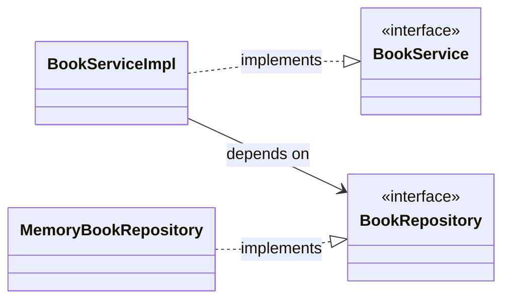

# Spring Core 학습 정리: step1 & step2

이 문서는 순수 Java 코드로 구현된 의존성 구조(step1)에서 Spring IoC 컨테이너 및 의존성 주입(DI)을 적용한 구조(step2)로 발전하는 과정을 세 가지 관점(초심자 비유, 주니어 원리, 면접 대비)에서 정리한 학습 가이드입니다.

---

## 1. 🐣 초심자를 위한 비유
우리가 **식당(Main)**에서 **요리사(BookServiceImpl)**를 고용해 **음식을 서빙(findBook/register)**하는 상황에 빗대어 이해해 봅시다.

### 🔌 step1 (도구가 손에 굳어버린 요리사)
* 요리사가 일을 하려면 **칼(MemoryBookRepository)**이 필요합니다.
* step1에서 요리사는 매장 주방에 들어가서 직접 칼을 사서 씁니다 (`new MemoryBookRepository()`).
* 만약 사장님이 "이제 칼 대신 더 안전한 **자동 슬라이서(DatabaseBookRepository)**로 도구를 바꾸자"라고 하면, 요리사 본인이 주방 코드를 뜯어고쳐 새로운 장비로 바꾸어야 합니다.
* 요리사가 요리라는 본업 외에 어떤 도구를 쓸지 고르고 조달하는 역할까지 책임져야 하므로 머리가 아픕니다. (**강한 결합**)

### 🧩 step2 (매니저가 장비를 쥐여주는 요리사)
* 이제 식당에 유능한 **매니저(AppConfig / Spring 컨테이너)**가 들어왔습니다.
* 요리사는 "저는 요리만 할 테니, 저한테는 `BookRepository` 규격에 맞는 도구만 주시면 됩니다"라고 요청합니다.
* 매니저(AppConfig)는 출근하면서 적당한 도구(`MemoryBookRepository`)를 골라 요리사를 생성할 때 손에 쥐여줍니다 (`new BookServiceImpl(bookRepository())`).
* 요리사는 도구가 어떻게 구해졌는지 신경 쓰지 않고 오직 요리에만 집중할 수 있게 되었습니다. (**제어의 역전 / 의존성 주입**)

---

## 2. 🛠️ 주니어를 위한 핵심 원리 설명

### 2.1. 제어의 역전 (IoC: Inversion of Control)
* **제어권의 주체 변화**: 전통적인 프로그래밍에서는 개발자가 작성한 프로그램 흐름에서 필요한 객체를 스스로 결정하고 생성(`new`)했습니다.
* **IoC 환경**에서는 프레임워크(Spring 컨테이너)가 개발자 대신 객체들의 생명주기(생성, 조립, 소멸)를 관리합니다. 제어의 제동 장치가 안에서 밖으로 넘어갔기 때문에 이를 **제어의 역전**이라고 부릅니다.

### 2.2. 의존관계 역전 원칙 (DIP: Dependency Inversion Principle)
* step1의 `BookServiceImpl`은 구체 클래스인 `MemoryBookRepository`에 직접 의존하고 있었습니다.
* step2에서는 `BookServiceImpl`이 구체 클래스가 아닌 **`BookRepository` 인터페이스(추상화)**에 의존하도록 설계가 개선되었습니다.
* 상위 모듈이 하위 모듈의 구체적인 구현에 의존하지 않고, 둘 다 추상화에 의존하게 만듦으로써 변화에 유연하게 대처할 수 있는 구조가 됩니다.

### 2.3. 스프링 빈(Bean)과 싱글톤(Singleton) 스코프
* **스프링 빈(Bean)**: Spring IoC 컨테이너에 의해 생명주기가 관리되는 객체들을 뜻합니다.
* **싱글톤 정책**: Spring은 기본적으로 컨테이너당 하나의 빈 인스턴스만 생성하여 공유합니다.
* `Main`에서 `getBean(BookService.class)`를 두 번 호출해 동일성(`==`)을 확인해 보면 `true`가 나옵니다. 매번 인스턴스를 새로 생성하여 가비지 컬렉션의 대상이 늘어나는 메모리 낭비를 줄이기 위함입니다.

---

## 3. 💬 면접을 위한 예상 질문 & 답변 (Q&A)

### Q1. IoC(제어의 역전)와 DI(의존성 주입)는 어떤 관계이며 차이점은 무엇인가요?
> **Answer**
> * **IoC(Inversion of Control)**는 프로그램의 제어 흐름 구조가 전통적인 방식에서 벗어나 외부 프레임워크로 위임되는 **일반적인 설계 원칙(Concept)**입니다.
> * **DI(Dependency Injection)**는 IoC 원칙을 실현하기 위한 **구체적인 구현 디자인 패턴**입니다. 객체 간의 관계를 소스코드 내부에서 직접 설정하지 않고 외부 컨테이너로부터 주입받아 동적으로 설정하는 방식을 의미합니다.

### Q2. 의존성 주입(DI) 방법들의 특징과, 왜 '생성자 주입'이 가장 권장되는지 설명해 주세요.
> **Answer**
> * **의존성 주입의 종류**:
>   1. **생성자 주입 (Constructor Injection)**: 객체 생성 시점에 생성자를 통해 의존성을 주입받습니다.
>   2. **수정자 주입 (Setter Injection)**: Setter 메서드를 통해 의존성을 주입받습니다.
>   3. **필드 주입 (Field Injection)**: 멤버 필드에 `@Autowired`를 기입하여 직접 주입받습니다.
> * **생성자 주입이 권장되는 이유**:
>   * **객체의 불변성(Immutability)**: 주입받을 필드를 `final`로 선언할 수 있어, 런타임 중에 의존성이 변하지 않음을 보장합니다.
>   * **의존성 누락 방지**: 객체 생성 시 필수 의존성이 빠지면 컴파일 에러가 발생하여 잠재적 문제를 예방합니다.
>   * **순환 참조 감지**: 애플리케이션 시작 시점에 서로를 순환 참조하는 빈 관계가 있다면 구동 단계에서 즉시 예외를 발생시켜 줍니다.
>   * **테스트 용이성**: 순수 Java 단위 테스트 작성 시 모의 객체(Mock) 주입이 쉬워 스프링 없이도 편리하게 테스트할 수 있습니다.

### Q3. Spring Bean의 기본 스코프인 '싱글톤 스코프'를 사용할 때 주의할 사항은 무엇인가요?
> **Answer**
> * 싱글톤 객체는 애플리케이션 전역에서 하나의 인스턴스를 공유하므로 멀티스레드 환경에서 동시성 이슈가 발생할 수 있습니다.
> * 따라서 싱글톤 빈은 내부 상태값을 변경할 수 있는 인스턴스 멤버 변수를 갖지 않도록 **무상태(Stateless)**로 설계해야 합니다.
> * 특정 요청에 따라 상태값을 변경하거나 저장해야 한다면 파라미터, 지역 변수, 혹은 다른 스코프(Request, Prototype 등)를 이용해야 합니다.
