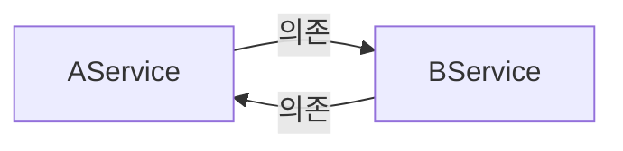

# Spring Core 학습 정리: step4 (의존성 주입(DI)의 3가지 방식 & 순환 참조)

이 문서는 스프링 컨테이너가 의존 관계를 주입하는 세 가지 대표적인 방식(생성자 주입, 필드 주입, 수정자 주입)의 특징과 비교 분석, Lombok을 활용한 생성자 주입 간소화, 그리고 주입 방식별 순환 참조(Circular Dependency) 감지 차이를 정리한 학습 가이드입니다.

---

## 1. 🐣 초심자를 위한 비유
회사(스프링 컨테이너)에서 신입 사원(Service)에게 업무용 노트북(Repository)을 지급하는 3가지 방식에 비유해 봅시다.

### 🏢 생성자 주입 (출근 첫날 노트북을 손에 쥐여주며 입사시키는 것)
* 사원이 입사 계약을 맺는 시점(객체 생성 시점)에 무조건 노트북을 지참하도록 규정합니다 (`new ConstructorBookService(notebook)`).
* 노트북 없이 맨몸으로는 입사(인스턴스 생성) 자체가 불가능하기 때문에, 사원이 사무실 자리에 앉았는데 노트북이 없어 일을 못 하는 빈손 상황(`NullPointerException`)이 애초에 방지됩니다. (**가장 안전하고 강제성 있는 방식**)

### 🛏️ 필드 주입 (출근했더니 사원 자리에 몰래 노트북을 두고 가는 것)
* 사원은 일단 빈손으로 입사했습니다. 그런데 어느 날 책상 위에 노트북이 스르륵 배달되어 놓여 있습니다 (`@Autowired private Notebook notebook`).
* 사적으로 외부에서 이 사원을 만나 일을 시키려 한다면(스프링 컨테이너 밖에서의 순수 자바 단위 테스트 등), 사원의 책상이 없으므로 노트북을 쥐여줄 마땅한 수단이 없습니다. 결국 사원은 하염없이 기다리다 빈손 상태로 일에 투입되어 사고가 납니다 (`NPE 발생`).

### 📦 수정자(Setter) 주입 (입사 후 별도의 사내 택배로 노트북을 배달받는 것)
* 사원이 입사한 뒤, 매니저가 전용 수령기(Setter 메서드)를 통해 노트북을 나중에 따로 전달해 줍니다 (`setNotebook(notebook)`).
* 사원이 입사를 마친 후 택배가 도착해 세팅되기 전까지의 짧은 공백 동안에는 노트북이 없는 빈손 상태가 될 수 있습니다. 즉, 의존 관계의 누락이나 임의 조작에 노출될 수 있습니다.

---

## 2. 🛠️ 주니어를 위한 핵심 원리 설명

### 2.1. 의존성 주입(DI)의 3대 방식
1. **생성자 주입 (Constructor Injection)**
   * 클래스의 생성자를 통해 의존 관계를 주입받는 방식입니다.
   * 필드를 `final`로 선언할 수 있어 객체 생성 이후 의존 관계가 절대 변하지 않는 **불변성(Immutability)**을 확보할 수 있습니다.
   * 생성자가 단 1개만 존재할 경우 스프링 4.3 이후부터는 `@Autowired` 어노테이션을 생략해도 자동으로 의존 관계가 주입됩니다.
2. **필드 주입 (Field Injection)**
   * 클래스 멤버 필드에 `@Autowired`를 붙여 스프링이 리플렉션 기술로 필드에 직접 주입하는 방식입니다.
   * 코드가 단순하고 직관적으로 보이지만, 외부(자바 코드 레벨)에서 의존성을 주입하거나 변경할 방법이 없어 프레임워크 의존성이 지나치게 극대화됩니다.
3. **수정자 주입 (Setter Injection)**
   * Setter(수정자) 메서드를 선언하고 그 위에 `@Autowired`를 기입하여 주입하는 방식입니다.
   * 주입할 대상이 필수적인 의존성이 아니거나(선택적 의존성), 실행 도중 의존 관계를 변경해야 하는 유연성이 필요할 때 적합합니다.

### 2.2. 순수 Java 단위 테스트 시 NPE(NullPointerException) 발생 원인
* 스프링 컨테이너의 개입 없이 `new FieldBookService()` 또는 `new SetterBookService()`를 단독으로 생성하여 테스트하려고 하면, `bookRepository` 필드는 `null` 상태로 존재합니다.
* 스프링이 실행되어 `@Autowired`를 통해 내부 필드나 세터에 값을 채워주지 않았기 때문입니다. 이 상태에서 비즈니스 메서드를 호출하면 곧바로 `NullPointerException`이 발생합니다.
* 반면, `ConstructorBookService`는 컴파일러 단계에서 생성자 인자로 `BookRepository`를 전달하도록 **강제**하기 때문에, 개발자가 의존성 주입을 누락하는 실수를 컴파일 타임에 즉시 잡아낼 수 있습니다.

```java
// 컴파일 에러 발생: 의존 관계가 누락되었음을 컴파일 시점에 알려줌!
BookService service = new ConstructorBookService(); 

// 해결: 컴파일러의 요구에 맞게 모의 객체(Mock) 또는 구현체를 직접 전달하여 안전하게 테스트 가능
BookService service = new ConstructorBookService(new MemoryBookRepository());
```

### 2.3. Lombok `@RequiredArgsConstructor`를 활용한 생성자 주입 간소화
* 생성자 주입은 불변 필드(`final`)를 정의하고 생성자 메서드를 직접 추가로 작성해야 하므로 타이핑이 번거로울 수 있습니다.
* 이때 Lombok의 **`@RequiredArgsConstructor`** 어노테이션을 클래스 레벨에 부여하면, `final` 지시어가 붙은 모든 멤버 필드를 매개변수로 취하는 생성자 코드가 컴파일 과정에서 자동으로 빌드됩니다. 
* 이를 통해 생성자 코드를 생략하면서도 완벽한 생성자 의존성 주입 효과를 누릴 수 있습니다.

### 2.4. 순환 참조(Circular Dependency) 문제와 주입 방식별 감지 시점
두 개 이상의 빈이 서로를 참조하여 무한 루프 상태에 빠지는 문제를 **순환 참조**라고 합니다.



* **생성자 주입 방식의 순환 참조 (AService ↔ BService)**
  * 생성자 주입은 빈을 생성하는 시점에 의존 객체 생성을 먼저 완료하고 매개변수로 전달해야 합니다.
  * 스프링 컨테이너가 로딩(구동)되는 시점에 의존관계의 고리가 맞물려 객체 생성에 실패하며 **`UnsatisfiedDependencyException`** 예외를 발생시키고 애플리케이션 가동 자체가 중단됩니다. 즉, **문제를 컴파일/배포 구동 단계에서 안전하게 조기 발견**할 수 있습니다.
* **필드 및 수정자 주입 방식의 순환 참조 (CService ↔ DService)**
  * 필드 및 수정자 주입은 일단 비어있는 빈 객체를 먼저 생성한 후, 생성 완료된 빈들에 의존성을 채워 넣는 방식을 사용하므로 스프링 컨테이너 가동(구동) 자체는 아무 문제없이 성공합니다.
  * 하지만 실제 런타임에 비즈니스 로직 메서드(`cService.hello()`)를 호출하는 순간, 서로의 메서드를 무한히 재귀 호출하게 되며 결국 JVM이 감당하지 못하고 **`StackOverflowError`**를 던지며 프로세스가 강제 종료됩니다. 즉, **런타임 에러로 장애가 발생**하게 됩니다.

---

## 3. 💬 면접을 위한 예상 질문 & 답변 (Q&A)

### Q1. 스프링 프레임워크가 생성자 주입 방식을 적극적으로 권장하는 3가지 핵심 이유는 무엇인가요?
> **Answer**
> * **첫째, 객체의 불변성(Immutability) 보장**: 서비스 객체의 의존 관계는 한 번 맺어지면 애플리케이션 종료 시까지 변하지 않아야 안전합니다. 생성자 주입을 쓰면 필드를 `final`로 선언할 수 있어 런타임 중 임의로 변경되는 실수를 차단합니다.
> * **둘째, 테스트 용이성**: 스프링 컨테이너를 구동하지 않고도 순수 Java 코드로 단위 테스트를 수행할 때 필요한 가짜 객체(Mock)를 생성자 파라미터로 쉽게 주입할 수 있어 단위 테스트 작성과 실행이 매우 빨라집니다.
> * **셋째, 순환 참조(Circular Dependency) 방지**: 생성자 주입 방식은 스프링 컨테이너가 빈을 생성하고 결합하는 시점에 순환 참조가 감지되면 애플리케이션 구동을 차단(`BeanCurrentlyInCreationException` 발생)하여 런타임 오류를 조기에 예방합니다.

### Q2. 필드 주입(Field Injection) 방식을 프로덕션 코드에서 절대 지양해야 하는 한계점은 무엇인가요?
> **Answer**
> * 필드 주입을 사용하면 프레임워크의 도움 없이는 의존 관계를 동적으로 주입하거나 모의 객체(Mock)로 치환하는 것이 불가능합니다.
> * 이는 테스트 코드 작성 시 스프링 컨테이너를 매번 띄우는 무거운 테스트 구조를 강제하게 되어 테스트 속도가 현저히 느려지는 주 원인이 됩니다.
> * 또한 애플리케이션이 프레임워크의 특정 메커니즘에 지나치게 종속되는 강한 결합을 발생시키며, 의존성이 많아져 단일 책임 원칙(SRP)을 위배하는 상황이 되어도 코드 외관상 문제를 알아차리기 어렵게 만듭니다.

### Q3. 순환 참조(Circular Dependency)가 발생했을 때 생성자 주입과 필드/수정자 주입의 감지 시점의 차이와 그 중요성을 설명해 주세요.
> **Answer**
> * **생성자 주입**은 빈 객체 생성 단계에서 서로의 주입을 요구하므로 **컨테이너 기동(로딩) 시점에 예외를 감지**하여 구동을 차단해 줍니다. 따라서 실수를 조기에 쉽게 진단할 수 있습니다.
> * 반면, **필드/수정자 주입**은 기동 시점에는 빈을 먼저 다 만들어두고 나중에 채우므로 컨테이너가 오류 없이 띄워지지만, 실제 서비스 중에 해당 객체의 메서드가 호출될 때 무한 재귀에 빠지며 **런타임 시점에 `StackOverflowError`가 발생**하여 실제 서비스 장애로 이어집니다.
> * 이러한 차이 때문에 장애를 조기에 방어하기 위해서라도 생성자 주입을 필히 사용해야 합니다.
